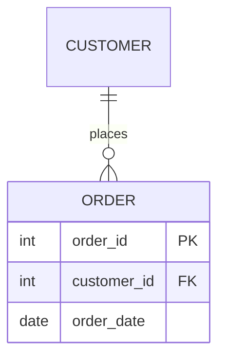

# EXTRA 07 — Entity/relationship challenges

Six modelling problems. Each one is a situation the naive design cannot
represent correctly. For each: **draw the fix as a Mermaid ER diagram, then
write the DDL.**

Solutions are in `solutions/extra/Extra07_ER_Modelling_Challenges_solution.md`,
with diagrams and DDL that was executed against this lab's MySQL.

---

## Mermaid ER syntax you need

Mermaid renders directly in GitHub, and in JupyterLab via a Markdown cell.
Docs: <https://mermaid.js.org/syntax/entityRelationshipDiagram.html>

````

````

Cardinality — the marker nearest an entity describes **that** entity's side:

| Left | Right | Meaning |
|---|---|---|
| `\|o` | `o\|` | zero or one |
| `\|\|` | `\|\|` | exactly one |
| `}o` | `o{` | zero or more |
| `}\|` | `\|{` | one or more |

Line style: `--` is identifying (solid), `..` is non-identifying (dashed).
Attribute keys: `PK`, `FK`, `UK`; trailing `"text"` adds a comment.

So `CUSTOMER ||--o{ ORDER : places` reads *one customer places zero or more
orders, and each order belongs to exactly one customer*.

---

## Challenge 1 — Many-to-many

A student takes many courses; a course has many students. Someone proposes
adding `course_id` to `student`.

1. Explain concretely what breaks the first time Ana takes two courses.
2. Draw the correct model.
3. Write the DDL, and make it **impossible** to enrol the same student on
   the same course twice.
4. Where does `grade` belong — on `student`, on `course`, or somewhere else?
   Why is that not an arbitrary choice?

---

## Challenge 2 — The attribute that is really an entity

`orders` stores `ShipMode` as a VARCHAR on every row (as our real
`superstore.orders` does). Someone wants to add a cost-per-kg and an SLA to
each shipping mode.

1. Name three problems with keeping `ShipMode` as free text once it carries
   attributes of its own.
2. Draw the normalised model.
3. Write the DDL and the `UPDATE`/migration sketch that converts existing
   rows without losing data.
4. Argue the other side: when is denormalised text genuinely the right call?

---

## Challenge 3 — Hierarchy / self-reference

Every employee reports to one manager. Managers are employees. Depth is not
fixed.

1. Draw it. (An entity may relate to itself — the relationship has the same
   entity on both sides.)
2. Write the DDL. What must `manager_id` allow, and why?
3. Write a recursive CTE that prints the org chart with indentation.
4. What stops someone making A report to B and B report to A? Is the
   database protecting you here?

---

## Challenge 4 — Supertype / subtype

A customer may be a **person** (first/last name, date of birth) or an
**organisation** (legal name, tax id). Both need an email and can place
orders. Half the columns are NULL for any given row.

1. Draw the supertype/subtype model.
2. Write the DDL so a subtype row cannot exist without its supertype row.
3. Show a query returning one display name per customer regardless of type.
4. Compare with the single-wide-table alternative. Name one thing each
   design makes easy and one it makes hard.

---

## Challenge 5 — History and point-in-time truth

A product's price changes over time. Today `products` holds one
`current_price`. Finance asks: *what did this order cost at the time it was
placed?*

1. Explain why the current schema cannot answer that question — even with
   perfect data.
2. Draw a model that can.
3. Write the DDL, and the query that prices an order **as at its order date**.
4. Our `superstore.orders` sidesteps this entirely. Look at its columns and
   work out how. What did that choice cost?

---

## Challenge 6 — Audit our own schema

Open `db-init/00_superstore_schema.sql`. It is a real schema with real
compromises.

1. Draw the current `superstore` ERD in Mermaid, with keys and cardinalities.
2. `orders.OrderID` is **not** unique — one order spans several rows, one per
   product. Name the entity that is missing from the model, and draw the
   version that has it.
3. `returns` has `OrderID` as its primary key, but `orders` has no unique
   constraint on `OrderID`. Explain why MySQL cannot enforce a foreign key
   from `returns` to `orders` here.
4. That FK was deliberately removed when the real data was loaded, and 14
   rows of `returns.csv` were dropped as orphans. Was dropping them the right
   call? Argue both sides in a few lines — this one has no single answer.
