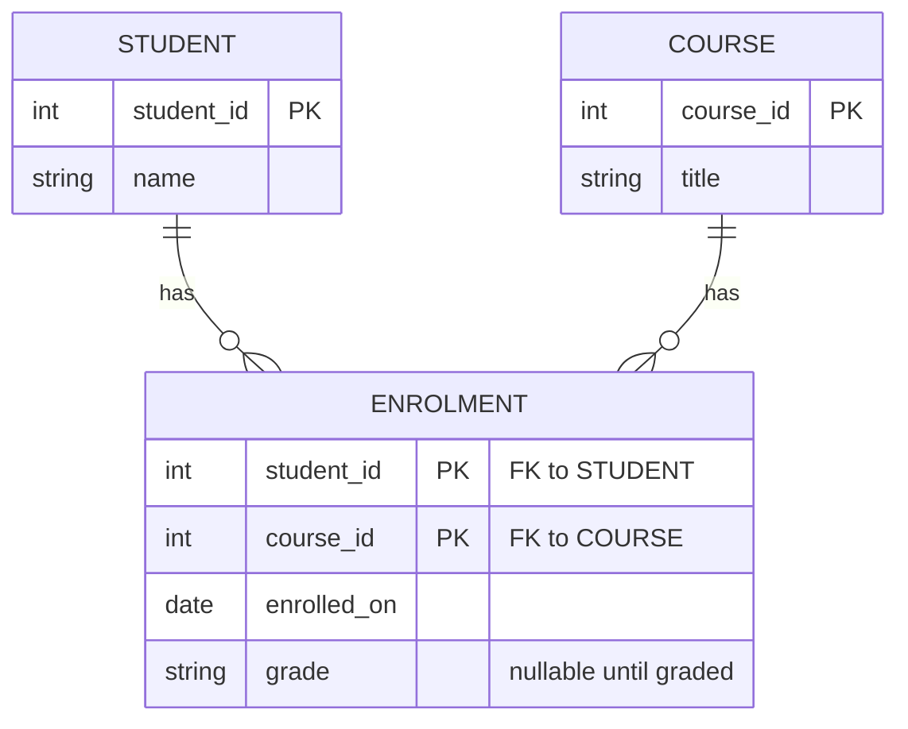
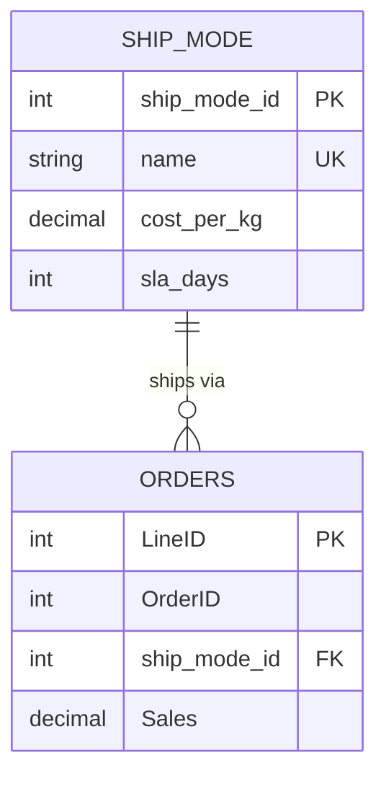
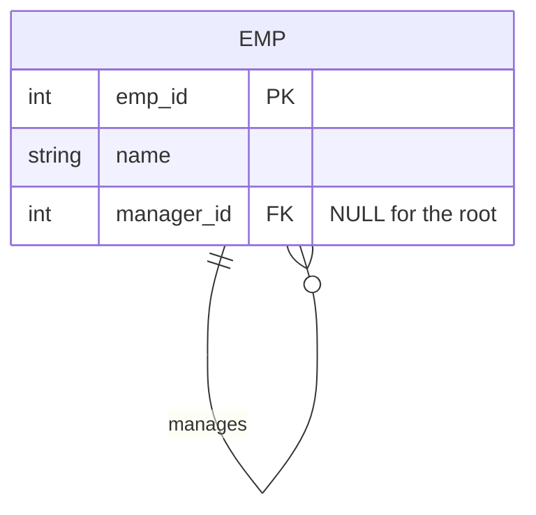
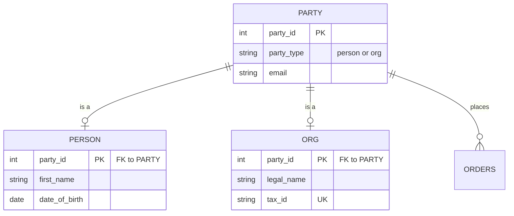
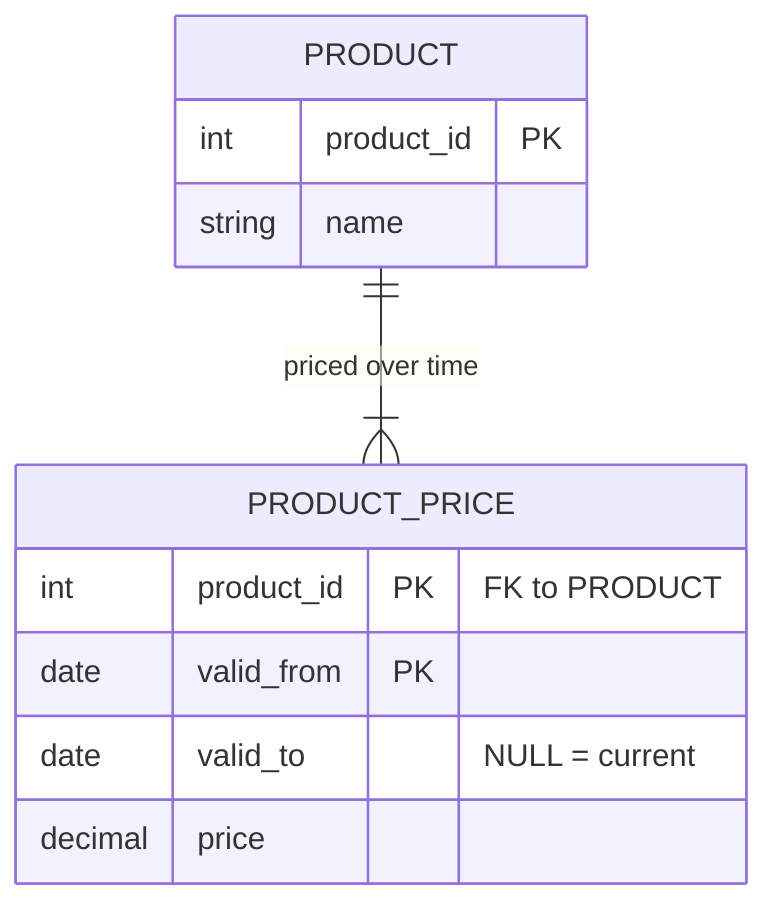
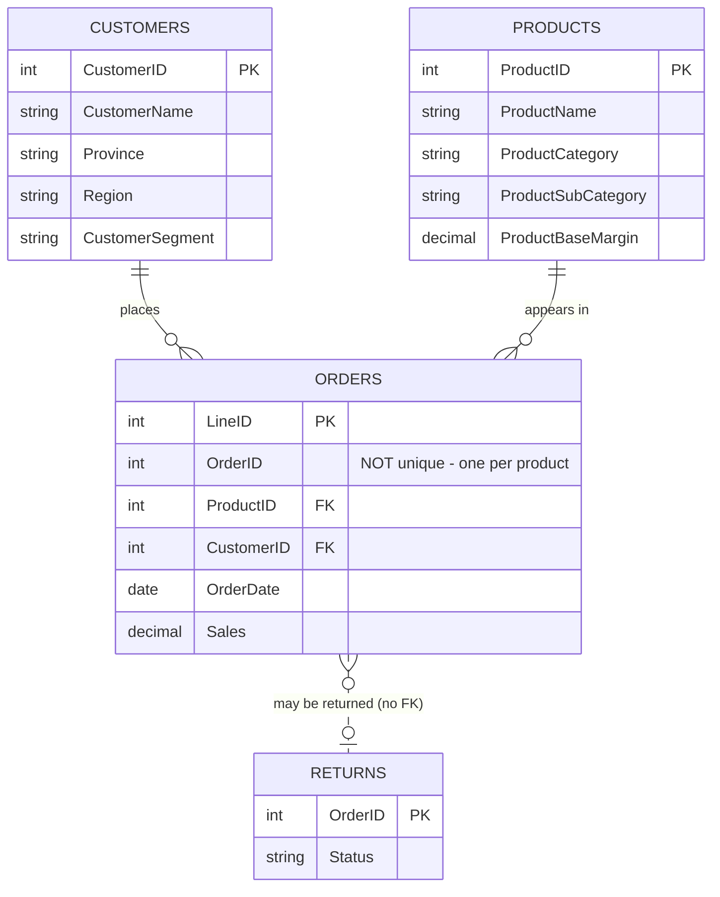
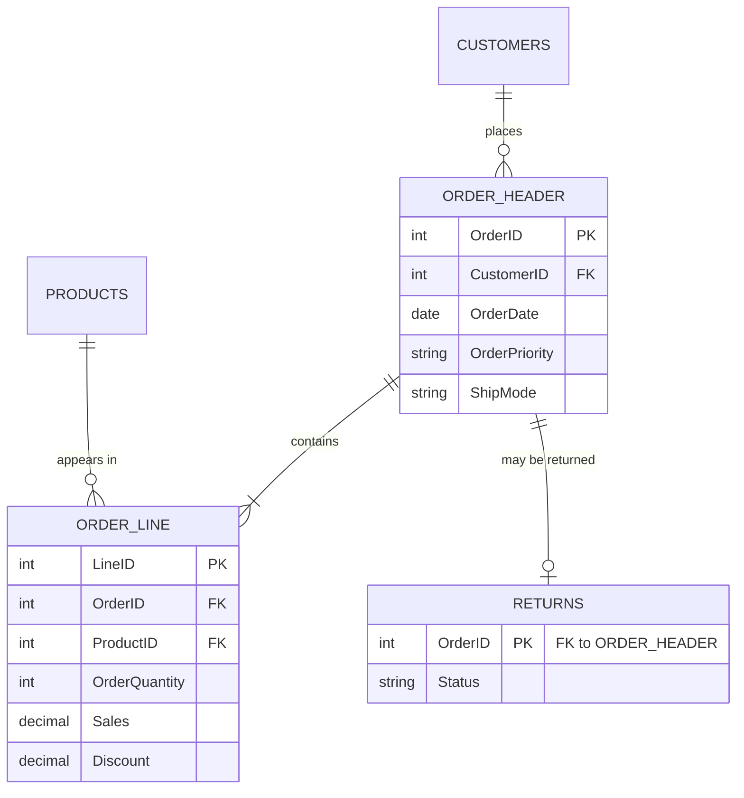

# EXTRA 07 — SOLUTIONS: entity/relationship challenges

Every DDL block below was executed against this lab's MySQL; quoted errors
and outputs are real.

---

## Challenge 1 — Many-to-many

**1. What breaks.** With `course_id` on `student`, a student row holds one
course. The moment Ana takes SQL *and* Python you must either overwrite the
first (losing it), or duplicate the whole student row — and now "Ana" exists
twice, with two IDs, and any count of students is wrong. The relationship is
many-to-many; a single FK column can only express many-to-one.



**2/3. DDL.** A many-to-many is always resolved by a third table. The
composite primary key is what makes a duplicate enrolment impossible:

```sql
CREATE TABLE student (student_id INT PRIMARY KEY, name VARCHAR(50));
CREATE TABLE course  (course_id  INT PRIMARY KEY, title VARCHAR(50));

CREATE TABLE enrolment (
    student_id  INT,
    course_id   INT,
    enrolled_on DATE NOT NULL,
    grade       CHAR(2),
    PRIMARY KEY (student_id, course_id),          -- <- prevents the duplicate
    FOREIGN KEY (student_id) REFERENCES student(student_id),
    FOREIGN KEY (course_id)  REFERENCES course(course_id)
);
```

Verified — the second enrolment of student 1 on course 10 is rejected:

```
ERROR 1062 (23000): Duplicate entry '1-10' for key 'enrolment.PRIMARY'
```

**4. Where `grade` belongs.** On `enrolment`. A grade is not a property of a
student (they have several) nor of a course (it has many). It is a property
of *this student in this course* — the relationship itself. That is the
general rule: **an attribute belongs wherever it is single-valued.** Getting
it wrong forces either NULLs or duplicated rows.

> Note the composite PK also fixes the grain at one enrolment per
> student-course *ever*. If a student may retake a course, that is a
> different question, and `enrolled_on` would join the key.

---

## Challenge 2 — The attribute that is really an entity

**1. Three problems** with free-text `ShipMode` once it has attributes:

- **No home for the new data.** Cost-per-kg and SLA would have to be repeated
  on all 8,060 order rows — and can disagree between rows.
- **No integrity.** `'Regular Air'`, `'regular air'` and `'Reglar Air'` are
  three distinct modes to the database. Nothing prevents the typo, and a
  `GROUP BY ShipMode` silently splits into extra groups.
- **No list of valid values.** You cannot ask "what shipping modes exist?"
  without scanning every order, and a mode used by no order is invisible.



**3. DDL and migration** — create, backfill from the distinct values, point
the fact table at it, then drop the text column. Backfill *before* adding the
constraint, or the FK fails on the first row:

```sql
CREATE TABLE ship_mode (
    ship_mode_id INT AUTO_INCREMENT PRIMARY KEY,
    name         VARCHAR(20) NOT NULL UNIQUE,
    cost_per_kg  DECIMAL(6,2),
    sla_days     INT
);

INSERT INTO ship_mode (name)
SELECT DISTINCT ShipMode FROM orders;          -- 3 rows here

ALTER TABLE orders ADD COLUMN ship_mode_id INT NULL;
UPDATE orders o JOIN ship_mode s ON o.ShipMode = s.name
   SET o.ship_mode_id = s.ship_mode_id;

ALTER TABLE orders
    ADD CONSTRAINT fk_orders_shipmode
    FOREIGN KEY (ship_mode_id) REFERENCES ship_mode(ship_mode_id);
-- only once every row is backfilled:
ALTER TABLE orders MODIFY ship_mode_id INT NOT NULL;
ALTER TABLE orders DROP COLUMN ShipMode;
```

**4. The other side.** Denormalised text is right when the value is a
*label*, not an entity: it has no attributes of its own, the set is stable,
and the join would buy nothing. Analytics tables lean this way deliberately —
a star-schema fact table repeats text to avoid a join on billions of rows,
and immutable history (a shipping mode *as it was named then*) is sometimes
exactly what you want. Normalise when the value grows attributes or must be
controlled; keep text when it is genuinely just a name.

---

## Challenge 3 — Hierarchy / self-reference



**2. DDL.**

```sql
CREATE TABLE emp (
    emp_id     INT PRIMARY KEY,
    name       VARCHAR(40),
    manager_id INT NULL,                       -- <- must be nullable
    FOREIGN KEY (manager_id) REFERENCES emp(emp_id)
);
```

`manager_id` **must allow NULL**: the person at the top reports to nobody.
Making it NOT NULL leaves you unable to insert the first row at all — there
is no existing employee for them to reference. NULL here means "no manager",
and it is the base case the recursion starts from.

**3. Org chart.**

```sql
WITH RECURSIVE chain AS (
    SELECT emp_id, name, manager_id, 1 AS lvl
    FROM emp WHERE manager_id IS NULL
    UNION ALL
    SELECT e.emp_id, e.name, e.manager_id, c.lvl + 1
    FROM emp e JOIN chain c ON e.manager_id = c.emp_id
)
SELECT lvl, CONCAT(REPEAT('  ', lvl - 1), name) AS org FROM chain ORDER BY lvl;
```

```
lvl  org
1    CEO
2      VP
3        Lead
4          Dev
```

**4. Cycles — and no, the database is not protecting you.** The FK only
checks that `manager_id` names an existing employee. It has no idea whether
following the chain leads back to where it started. Tested:

```sql
UPDATE emp SET manager_id = 4 WHERE emp_id = 1;   -- CEO now reports to Dev
```

Accepted without complaint. The damage shows up only when something walks the
graph:

```
ERROR 3636 (HY000): Recursive query aborted after 51 iterations.
Try increasing @@cte_max_recursion_depth to a larger value.
```

Note how misleading that message is — it suggests raising a limit, when the
real problem is corrupt data. `cte_max_recursion_depth` is a guard rail
against a runaway query, not a cycle detector. Preventing cycles needs an
application check, a trigger, or a periodic audit.

---

## Challenge 4 — Supertype / subtype



**2. DDL.** The subtype's primary key *is* the supertype's — that is what
makes the "is a" one-to-one and stops a `person` row existing without its
`party`:

```sql
CREATE TABLE party (
    party_id   INT PRIMARY KEY,
    party_type ENUM('person','org') NOT NULL,
    email      VARCHAR(80)
);
CREATE TABLE person (
    party_id   INT PRIMARY KEY,
    first_name VARCHAR(40),
    FOREIGN KEY (party_id) REFERENCES party(party_id) ON DELETE CASCADE
);
CREATE TABLE org (
    party_id   INT PRIMARY KEY,
    legal_name VARCHAR(80),
    FOREIGN KEY (party_id) REFERENCES party(party_id) ON DELETE CASCADE
);
```

**3. One display name per customer.**

```sql
SELECT p.party_id, p.party_type,
       COALESCE(pe.first_name, o.legal_name) AS display
FROM party p
LEFT JOIN person pe USING (party_id)
LEFT JOIN org    o  USING (party_id);
```

```
party_id  party_type  display
1         person      Ana
2         org         Acme Ltd
```

**4. Versus one wide table.**

| | Wide table | Supertype/subtype |
|---|---|---|
| Easy | Every read is one table, no joins. Adding a field is one `ALTER`. | Type-specific columns can be `NOT NULL`. Each type is described honestly. |
| Hard | Every type-specific column must be nullable, so the schema cannot enforce "a person must have a first name". NULL stops meaning "unknown" and starts meaning "not applicable" — two very different things in one marker. | Every read needs a join, and "what type is this?" is answered in two places (`party_type` and which subtype row exists) that can disagree. |

Rule of thumb: few, stable subtypes with few differing columns → wide table.
Many subtypes, or subtypes with real constraints → split it.

---

## Challenge 5 — History and point-in-time truth

**1. Why the current schema cannot answer it.** `current_price` holds *one*
value: today's. Yesterday's price was overwritten and no longer exists
anywhere. This is not a data-quality problem — the information was destroyed
by the schema's design. Perfect data entry would not help.



**3. DDL and as-at query.**

```sql
CREATE TABLE product_price (
    product_id INT,
    valid_from DATE,
    valid_to   DATE NULL,                      -- NULL = still in force
    price      DECIMAL(10,2) NOT NULL,
    PRIMARY KEY (product_id, valid_from),
    FOREIGN KEY (product_id) REFERENCES product(product_id)
);

-- price as at a given date
SELECT p.name, pp.price
FROM product p
JOIN product_price pp ON pp.product_id = p.product_id
WHERE @as_at >= pp.valid_from
  AND (pp.valid_to IS NULL OR @as_at <= pp.valid_to);
```

Verified — one product, two price rows (100 until 2025-06-30, 120 after):

```
as at 2025-03-01 -> Chair 100.00
as at 2025-09-01 -> Chair 120.00
```

**4. How `superstore.orders` sidesteps it.** It stores `UnitPrice`, `Sales`,
`Discount` and `Profit` **on the order line itself**. The price is copied at
the moment of sale, so the order carries its own history and no price table
is needed to answer "what did this cost then".

That is a real technique, not a hack — the same reason an invoice PDF is
archived rather than regenerated. What it costs: the value is now duplicated
on every line and can drift from the catalogue; you cannot ask "what was the
list price on a day nothing sold"; and a correction means updating many rows.
Copy the value when it must be *immutable evidence*; keep a history table
when you must *reconstruct* state at arbitrary times.

---

## Challenge 6 — Audit our own schema

**1. Current state.**



The dashed line to `RETURNS` is deliberate: there is no enforced FK (see 3).

**2. The missing entity is the ORDER itself.** `orders` is really *order
lines*. Everything true of the order as a whole — date, customer, priority,
ship mode — is repeated on every line, and can disagree between lines of the
same order. The honest model splits them:



With a header table, `RETURNS.OrderID` finally has a unique key to point at —
which resolves 3 as a side effect.

**3. Why the FK is impossible today.** A foreign key must reference a
**uniquely indexed** column: the database has to identify exactly one parent
row. In `orders`, `OrderID` is not unique (that is the whole point — one row
per product), so `REFERENCES orders(OrderID)` is rejected. The schema
comments this explicitly. It is not a missing constraint anyone forgot; the
grain of the table forbids it.

**4. Dropping the 14 orphan returns — both sides.**

*For:* they reference orders that do not exist, so any join silently ignores
them; keeping them means every future query needs to remember they are
there. Loading them would also have blocked the FK had one been possible. A
clean teaching dataset should not ship known-broken rows.

*Against:* those 14 rows were evidence. Real return data referencing missing
orders usually means the orders extract was incomplete — the orphans were a
*symptom*, and deleting them destroyed the signal while leaving the cause.
Return-rate figures are now computed on a quietly reduced denominator, and
nothing in the data says so.

A defensible middle path: load them into a quarantine table rather than
discarding them, so the count stays visible and the decision stays reversible.
The general lesson: dropping bad rows is a *decision about evidence*, and it
should be recorded where the people using the data will see it — not only in
a commit message.
